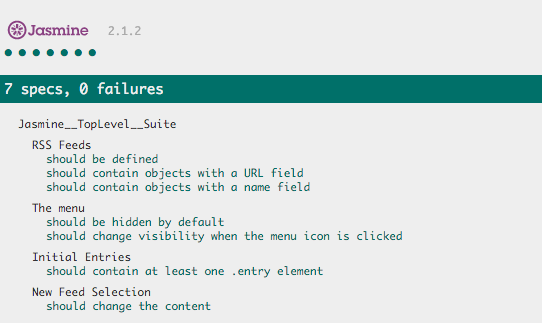

## Project Overview

In this project I have been given a web-based application that reads RSS feeds. The original developer of this application clearly saw the value in testing, they've already included [Jasmine](http://jasmine.github.io/) and even started writing their first test suite! Unfortunately, they decided to move on to start their own company and I'm now left with an application with an incomplete test suite. That's where I come in.

## Tests

The project includes the following unit tests. All tests should pass.

1. A test that loops through each feed in the allFeeds object and ensures it has a URL defined and that the URL is not empty.
2. A test that loops through each feed in the allFeeds object and ensures it has a name defined and that the name is not empty.
3. A test that ensures the menu element is hidden by default.
4. A test that ensures the menu changes visibility when the menu icon is clicked.
5. A test that ensures when the loadFeed function, which is asynchronous, is called and completes its work, there is at least a single .entry element within the .feed container.
6. A test that ensures when a new feed is loaded by the loadFeed function that the content actually changes.

## Run instructions

This application can be run locally by just opening the index.html in a browser.

## Screenshot

